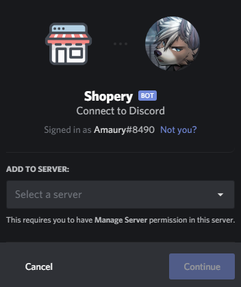
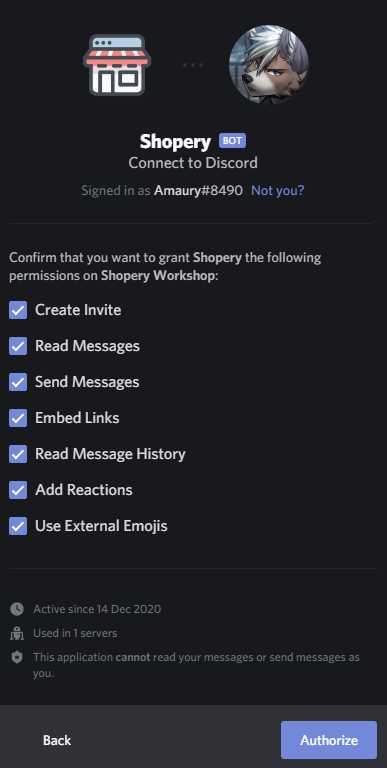

# Invite Shopery

## Open the OAuth2 tab

To begin, you'll need to open the OAuth2 page, where Discord will ask for your permission to add the bot to your server. You can do so [here](https://shopery.xyz/invite).

## Select a server

You will now be prompted to change a server. Choose the server in which you want to add Shopery.


You need the **Manage Server** permission in the server you want to invite Shopery in, otherwise it won't appear in the list!


## Select the permissions

You will now be prompted to select will permissions you want to keep for the bot. These permissions are all the permissions the bot require to function properly. You can check our [permissions](permissions.md) page to know more information on how they are used.

## Enjoy!

The bot is now on your server. Discover all of our commands by going [here](../commands.md)!

